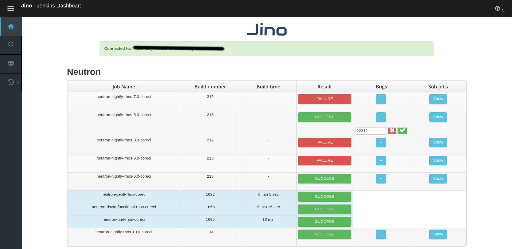

# Jino

NOTE: The project is in the middle of a refactor process. It's NOT USABLE at the moment.

Jino is a web server for managing single or multiple Jenkins instances.

It allows you to:

    * Display jobs from multiple Jenkins instances

* [Requirements](#requirements)
* [Installation](#installation)
* [Getting Started](#getting-started)
* [Configuration](#configuration)
* [Screenshots](#screenshots)

## Requirements

* Python >= 2.7

## Installation

    virtualenv .venv && source .venv/bin/activate
    pip install .

You can also run the quick setup script in this directory:

    chmod +x quick_setup.sh && ./quick_setup.sh

## Run Jino Web Application

    jino-server runserver

## Run Jino Agent

    jino-agent

## Configuration 

The default location for Jino configuration is '/etc/jino/jino.conf'.
You can specify it by using the CLI: --conf <conf_file_path>

You can find sample in samples/jino.conf

## Screenshots

